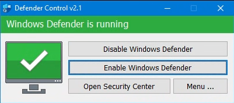

# zach_HomeServeronWin

基於 Windows 系統的家庭服務器搭建方案

> 該文檔旨在記錄並分享一套自用的基於 Windows 系統搭建的家庭服務器的解決方案。  
> 如果您也有類似的需求，可斟酌參考。  
> 如果您有更優的解決方案，歡迎在 Issues 中提出。

此解決方案除去 Windows 系統盡量使用免費或開源軟件，截至目前此解決方案除去硬件和 Windows 系統您無需為軟件作出花銷。  
如果您對某些軟件有更高要求，您可選擇購買其付費服務。

## 硬件準備

### 硬件搭建平台介紹

- CPU：[Intel® Core™ i3-8100 處理器](https://www.intel.com.tw/content/www/tw/zh/products/sku/126688/intel-core-i38100-processor-6m-cache-3-60-ghz/specifications.html)
- 記憶體：DDR4 2666Mhz 8GB\*1
- 系統硬碟：[SK hynix PC801 1TB](https://product.skhynix.com/products/ssd/cssd/pc801_bc901.go)
- 主機板：[GIGABYTE Z370 AORUS ULTRA GAMING 2.0](https://www.aorus.com/zh-hk/motherboards/Z370-AORUS-ULTRA-GAMING-20-OP-rev-10/Key-Features)
- 電源：[Segotep 全模 850](https://www.segotep.com/CN/product_show.aspx?id=808)

## 系統安裝

在此選用 [Windows 10 企業版 LTSC 2019](https://learn.microsoft.com/zh-hk/lifecycle/products/windows-10-enterprise-ltsc-2019) 作為家庭服務器的底層系統。

選取原因：

1. 整機硬件較老舊，選用舊版系統保證流暢運行。
2. LTSC 不會有頻繁的惱人的系統更新，保證作為服務器穩定運行。
3. LTSC 去除大多無用系統組件，保證體統清淨。
4. 企業版具有較為完整的管理工具，例如使用 RDP 進行遠程管理。

> 如果您有能力自行精簡系統並且能保證系統的兼容性以及穩定性，您可以選擇任一自己喜愛的版本作為底層 Windows 系統。
>
> 當然，以下所有方案均基於微軟官網原版系統，可能與您選用的您喜愛的修改版系統存在不可預測的兼容性問題。

安裝步驟：

\*未完待續

## 服務部署

### 系統“優化”

寫在前面：在該部分會對部分 Windows 係統功能進行不同程度地禁用，對於這些操作的必要性在此不作任何討論。  
如果您沒有相關需求，可以跳過此部分。如果您意向了解部分操作，可以接著向下閱讀此部分。

#### 禁止系統更新

> 個人觀點：不建議任何通過刪除 Windows 組件以禁止 Windows 系統更新的行為。

經過反復嘗試不同方法，得出目前個人認為最優解：選用 [Windows Update Blocker](https://www.sordum.org/9470/windows-update-blocker-v1-8/) 進行管理。

使用方法

1. 根據您的系統架構執行相應的可執行文件

   執行後的界面如下圖所示

   

2. 選擇“Disable Updates”並勾選“Protect Services Settings”，點擊“Apply Now”。

3. 當界面如下圖所示時，恭喜您，您的系統已成功被禁止進行系統更新。

   

> **注意！使用該軟件禁用系統更新後可能導致部分係統組件加載或下載失敗。  
> 如果您遇到此類問題，可嘗試在該軟件中允許系統更新後再次對系統進行更改或加載您需要的加載項。**

#### 關閉 Windows Defender

儘管關閉 Windows Defender 的系統原生方法相較於禁用系統更新便於操作，但仍有部分功能無法完全關閉，因此選用和上述軟件類似的 [Defender Control](https://www.sordum.org/9480/defender-control-v2-1/) 進行管理。

使用方法

1. 在解壓程序前，建議先關閉 Windows Defender 的實時保護，因為該可執行文件大概率會被 Windows Defender 識別為病毒文件並加入管控區。為避免麻煩建議可先執行此步驟。
2. 根據您是否執行了第一步，以下為兩種情況
   | 如果您執行了第一步操作，則執行可執行文件後界面如下 | 如果您未執行第一步且您手速夠快，則執行可執行文件後界面如下 |
   | :------------------------------------------------: | :--------------------------------------------------------: |
   |  |  |

   無論您是否執行了第一步驟，點擊“Disable Windows Defender”。

3. 當界面如下圖所示時，恭喜您，您已成功關閉 Windows Defender 功能。

   

#### 關閉系統保護

[Windows 係統保護](https://support.microsoft.com/zh-hk/windows/system-protection-e9126e6e-fa64-4f5f-874d-9db90e57645a)的初始目的是為了在系統環境出現嚴重錯誤時方便系統恢復到系統環境沒有出錯的某個時點。  
優勢是便於系統調試，可能的缺陷是佔用大量硬碟存儲空間。

關閉方法

1. 打開控制面板
2. 系統與安全 -> 系統 -> 系統保護
3. 選中需要修改的驅動器，配置 -> 禁用係統保護 -> 刪除此驅動器的所有還原點 -> 應用 -> 確定
4. 如果您有多個驅動器需要關閉系統還原點，則重複執行 3 操作

> 拓展閱讀：[如何移除除了最新還原點以外的所有系統還原點](https://support.microsoft.com/zh-hk/topic/%E5%A6%82%E4%BD%95%E7%A7%BB%E9%99%A4%E9%99%A4%E4%BA%86%E6%9C%80%E6%96%B0%E9%82%84%E5%8E%9F%E9%BB%9E%E4%BB%A5%E5%A4%96%E7%9A%84%E6%89%80%E6%9C%89%E7%B3%BB%E7%B5%B1%E9%82%84%E5%8E%9F%E9%BB%9E-d43d697b-09ac-bef6-8a02-1000a18a9b82)

### 遠程管理

#### 軟件

##### ToDesk

作為一款具有免費選項的商業軟件，[ToDesk](https://www.todesk.com/) 提供連接的穩定性具有絕對保障。如果您對遠程桌面連接的畫素無過高要求，但對可連通性以及穩定性有需求，這是一個不錯的選項。

在此選用 ToDesk 僅作為冗餘連接，以防其他所有方式均無法接通。僅將 ToDesk 設為開機自啟並設置能記住的固定的連接密鑰即可，這是遠程連接此服務器桌面的最後防線。

##### Parsec

為了更好的控制體驗以及配置的便捷性，在此選用 [Parsec](https://parsec.app/) 作為串流工具。

在被控服務器和控制客戶端同時安裝 Parsec 並登錄同一賬戶後，在 Parsec 面板上一鍵即可鏈接。

> 建議將家庭服務器所連接的路由開啟 UPnP 功能，以便提升連接成功率。  
> 如果您可以保證防火墻的設置，為家庭服務器開啟 DMZ 也是不錯的解決方案。

如果您認為免費版本的 Parsec 無法滿足您的全部需求，例如多屏顯示，您可自行搭建 Sunshine + Moonlight 的解決方案，在此不作過多討論。

#### 直連

##### DDNS

##### DMZ 與端口映射

### 下載

#### qbEE

#### Peer Ban Helper

### 影音服務

#### Jellyfin

### 文件分享

#### WebDav

### 雜項
